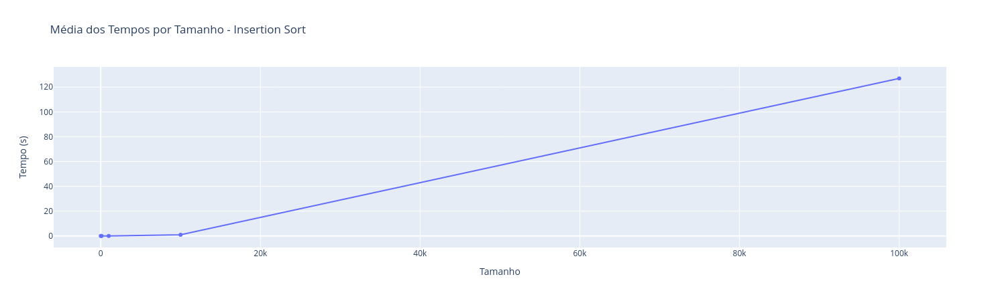
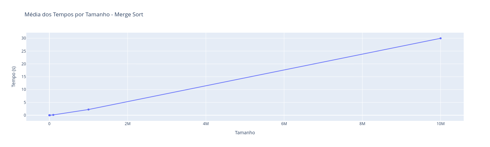
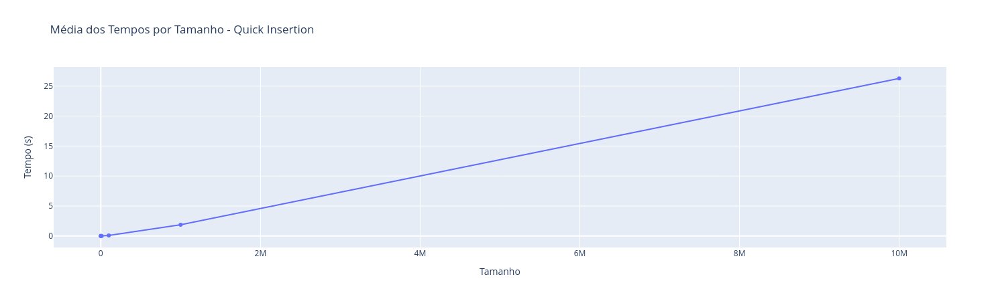

# 🚀 Trabalho de PAA  

> Este repositório é o resultado de um trabalho para a disciplina **Projeto e Análise de Algoritmos (PAA)**. Comparamos os algoritmos **Merge Sort**, **Insertion Sort**, **Bubble Sort** e **Quick Sort**, além de desenvolver um algoritmo híbrido: **Quick + Insertion Sort**.  


## 📂 Estrutura do Repositório  

### 🗂️ Pastas  
- **`algoritmos/`**: contém todos os algoritmos testados.  
- **`data/`**: bases de dados geradas para testar os algoritmos.  
- **`resultados/`**: resultados dos testes dos algoritmos.  

### 📄 Arquivos  
- **`data.py`**: gera arrays aleatórios para os testes.  
- **`main.py`**: script principal com execução e menu.  
- **`readme.md`**: descrição do repositório.  
- **`requirements.txt`**: bibliotecas utilizadas.  
- **`result.ipynb`**: notebook para gerar gráficos e analisar os dados dos testes.  
- **`teste-algoritmos.ipynb`**: notebook para testar cada algoritmo individualmente.  

## 🛠️ Como rodar o projeto?  

1. Clone o repositório:  
   ```bash
   git clone https://github.com/zairobastos/trabalhoPAA.git
   ```  

2. Crie um ambiente virtual:  
   ```bash
   virtualenv .venv
   ```  

3. Ative o ambiente virtual:  
   ```bash
   source .venv/bin/activate
   ```  

4. Instale as dependências:  
   ```bash
   pip install -r requirements.txt
   ```  


## 🔢 Implementações  

Clique para acessar cada algoritmo:  
1. [Bubble Sort](algoritmos/bublesort.py)  
2. [Insertion Sort](algoritmos/insertionsort.py)  
3. [Merge Sort](algoritmos/mergesort.py)  
4. [Quick Sort](algoritmos/quicksort.py)  


## 📊 Geração de Dados  

Os dados gerados estão na pasta **[`data/`](data/)**, exceto para tamanhos **10⁷** e **10⁸** (não foi possível subir no GitHub). Para gerar esses dados, rode o arquivo `data.py` informando os nomes de arquivo correspondentes.  


## ⏱️ Tempos de Execução  

Confira os tempos médios dos algoritmos abaixo. Alguns casos não puderam ser testados devido a estouro de memória.  

### 1️⃣ Bubble Sort  
| Entrada (n) | Tempo (s)  |  
|:-----------:|:----------:|  
| 10          | 0,000010   |  
| 100         | 0,000415   |  
| 1000        | 0,034956   |  
| 10000       | 2,394462   |  
| 100000      | 300,5399   |  

### 2️⃣ Insertion Sort  
| Entrada (n) | Tempo (s)  |  
|:-----------:|:----------:|  
| 10          | 0,000005   |  
| 100         | 0,000110   |  
| 1000        | 0,013009   |  
| 10000       | 0,974736   |  
| 100000      | 127,0000   |  

### 3️⃣ Merge Sort  
| Entrada (n) | Tempo (s)  |  
|:-----------:|:----------:|  
| 10          | 0,000013   |  
| 100         | 0,000106   |  
| 1000        | 0,001166   |  
| 10000       | 0,011174   |  
| 100000      | 0,135883   |  
| 1000000     | 2,237694   |  
| 10000000    | 29,97352   |  

### 4️⃣ Quick Sort  
| Entrada (n) | Tempo (s)  |  
|:-----------:|:----------:|  
| 10          | 0,000009   |  
| 100         | 0,000051   |  
| 1000        | 0,000689   |  
| 10000       | 0,009576   |  
| 100000      | 0,103646   |  
| 1000000     | 1,941980   |  
| 10000000    | 26,15017   |  


## 📈 Resultados e Gráficos  

Apenas o **Insertion Sort** foi mais rápido em um único caso (n=10). Seguem os gráficos para visualização:  

- **Bubble Sort**  
    

- **Insertion Sort**  
    

- **Merge Sort**  
    

- **Quick Sort**  
    

- **Quick + Insertion Sort**  
    
